# Канали та акведуки

#### Опис


Побудуємо мости, канали та акведуки з водою, як стародавні греки


## Згадаймо🤔

1. Як створити фонтан в Minecraft?&#x20;
2. Як створити ванни для води у башті?
3. Як запрограмувати **появу та** **зникнення** води?&#x20;

## Сьогодні ми:

1. Створимо канали й заповнимо їх водою у відносних координатах.&#x20;
2. Створимо міст з квадратними і круглими підпорами.
3. Створимо акведуки.


Вода в усі часи була основою життя, і люди намагалися цю стихію «приручити».&#x20;

**Канал** (від лат. canalis — труба, жолоб) — штучне русло (водовід) правильної форми з безнапірним рухом води, влаштоване в ґрунті.

Вважається, що перші канали були зрошувальними, тобто служили для господарських потреб: поливу полів, для худоби тощо.

Перші зрошувальні канали з'явилися в кінці VI тисячоліття до н.е. в **Месопотамії.** Приблизно тоді ж, мабуть, почали зводити іригаційні системи і в Стародавньому Єгипті


| **№**         | **1**                                                                                                                                                                                                                      |
| ------------- | -------------------------------------------------------------------------------------------------------------------------------------------------------------------------------------------------------------------------- |
| **Завдання**  | <ol><li>Сформуйте канал <strong>від 40 до -40</strong> відносно себе.</li><li>Сформуйте канал <strong>від 20 до -20</strong> відносно себе.</li><li>Сформуйте канал <strong>від 0 до -20</strong> відносно себе.</li></ol> |
| **Код**       | .png>)                                                                                                                                                                                       |
| **Результат** | .png>)                                                                                                                                                                                       |

| **№**         | **2**                                                                                                                                                                                            |
| ------------- | ------------------------------------------------------------------------------------------------------------------------------------------------------------------------------------------------ |
| **Завдання**  | <ol><li>Додайте басейни <strong>2x6</strong> з країв каналу.</li><li>Додайте басейни <strong>3x6</strong> з країв каналу.</li><li>Додайте басейни <strong>4x8</strong> з країв каналу.</li></ol> |
| **Код**       | .png>).png>)                                                                                                                       |
| **Результат** | .png>)                                                                                                                                                             |

## Творче завдання

Створіть лодку та покатайтеся по каналу.

## Міст із водою

|               |                                                                                                                                                                                                                                                                                                                                                                                                                                                                                                                                                                                                                             |
| ------------- | --------------------------------------------------------------------------------------------------------------------------------------------------------------------------------------------------------------------------------------------------------------------------------------------------------------------------------------------------------------------------------------------------------------------------------------------------------------------------------------------------------------------------------------------------------------------------------------------------------------------------- |
| **№**         | **3**                                                                                                                                                                                                                                                                                                                                                                                                                                                                                                                                                                                                                       |
| **Завдання**  | <ol><li>Створіть підпорку для моста з водою висотою в <strong>5 блоків</strong>, довжиною в <strong>81 блок</strong> (<strong>від -40 до 40 відносно вас</strong>), шириною в <strong>4 блоки</strong> (від <strong>2 до 5</strong>).</li><li>Створіть підпорку для моста з водою висотою в <strong>5 блоків</strong>, довжиною в <strong>41 блок</strong> <strong>(від -20 до 20 відносно вас)</strong>, шириною в <strong>4 блоки (від 2 до 5)</strong>.</li><li>Створіть підпорку для моста висотою в <strong>7 блоків,</strong> довжиною в <strong>50 блоків</strong> та шириною в <strong>5 блоків.</strong></li></ol> |
| **Код**       | 
 
                                                                                                                                                                                                                                                                                                                                                                                                                                                                                                                |
| **Результат** | .png>)                                                                                                                                                                                                                                                                                                                                                                                                                                                                                                                                                                                        |

## Міст із водою

| **№**         | **4**                                                                                                                                                                                                                                                                                                                                                                                                                           |
| ------------- | ------------------------------------------------------------------------------------------------------------------------------------------------------------------------------------------------------------------------------------------------------------------------------------------------------------------------------------------------------------------------------------------------------------------------------- |
| **Завдання**  | <ol><li>Створіть квадратні підпорки для потока з водою. Шириною <strong>5 блоків</strong> та із проміжками в <strong>5 блоків</strong>.</li><li>Створіть квадратні підпорки для потока з водою. Шириною <strong>6 блоків</strong> та із проміжками в <strong>4 блок</strong>и.</li><li>Створіть квадратні підпорки для потока з водою. Шириною <strong>3 блоки</strong> та із проміжками в <strong>7 блоків</strong>.</li></ol> |
| **Код**       | 
 
                                                                                                                                                                                                                                                                                                                     |
| **Результат** | .png>)                                                                                                                                                                                                                                                                                                                                                                                           |

## Міст зі сводом

| **№**         | **5**                                                                                                        |
| ------------- | ------------------------------------------------------------------------------------------------------------ |
| **Завдання**  | <ol><li>Створіть округлі підпорки для потоку з водою.</li></ol>                                              |
| **Код**       | 
 
      |
| **Результат** | 
 
 |

## Акведуки

### 1. Початок побудови

Будуємо стіну на **85 блоків в ширину**, відсунуту від нас на **10 блоків** на північ та з довжиною **5 блоків**, висота — 21 блок

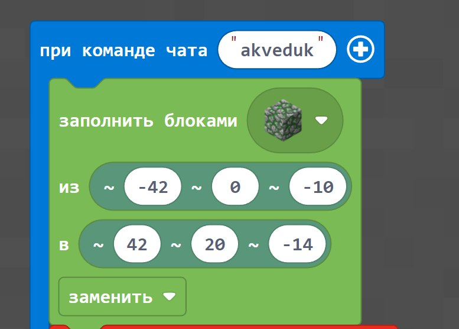

Додаємо **змінну «1»,** яка буде відповідати за центри кіл, які ми будемо вирізати зі стіни для арок.&#x20;

Відповідно наше **коло буде радіусом на 5 блоків** та один блок буде на перегородку між вирізаними колами. Відповідно отримаємо, що перший центр кола повинен знаходитись на координаті **-36**, бо (-42+1+5=-36).&#x20;

Потрібно зробити **7 повторів** вирізання для того, щоб отримати **7 повноцінних отворів** та перегородки між ними.

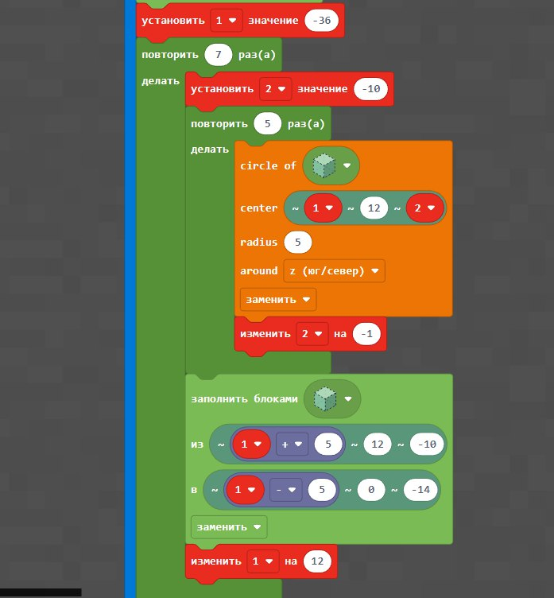

**Змінна «2»** відповідає за те, щоб наші кола прорізались на всю довжину стіни, відповідно перше коло повинно прорізатись на координаті **-10**.&#x20;

Далі потрібно зробити **5 повторів** і кожного разу змінювати **змінну «2»** на **-1**, щоб отримати проріз від **-10 до -14** коордитнати.


Вирізання прямокутника під колом іде наступним чином: ширину прямокутника ми позначаємо, як координату центру кола на поточний момент (змінна «1») +/- 5 (радіус нашого кола). Виходить, що наш прямокуник повітря буде вирізати ділянку під колом згідно з його радіусом.&#x20;


**Змінну «1» потрібно кожного разу збільшувати на 12**, враховуючи радіуси кіл, на які йде зсув перегородки між ними, а також координати радіусу наступного кола.

Тут ми додаємо блоки води для нашого акведуку: з **-41го по 42й блок** в довжину, щоб отримати невеликий водоспад.

Будуємо внизу щось типу невеликого басейну, куди буде стікати вода, за допомогою паралелепіпеду. Вирізаємо в ньому отвір та верхню частину.

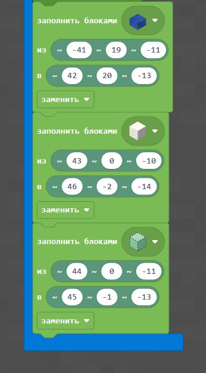

### 2. Другий код

Для побудови **двох'ярусного акведуку** потрібно додати **змінну «3»**, яка буде відповідати за зміну висоти всіх елементів першого акведуку на певну величину.&#x20;


Наприклад, якщо висота нашого нижнього акведуку **від 0 до 20го блоку**, то для того, щоб побудувати нижній акведук, потрібно **змінній «3»** дати значення **0**, щоб на першому кроці все залишилось без змін.


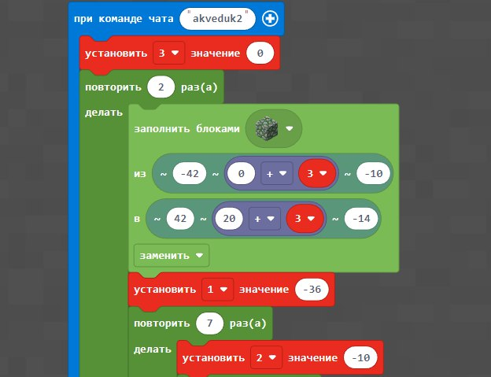

Далі ми закидуємо до повторення всі команди з побудови акведуку та наповнення його водою, не забуваючи змінити висоту всіх елементів, використовуючи математику:&#x20;

`початкова`` `**`число висоти`**` ``+ поточна`` `**`змінна «3»`**`= висота поточного елементу.`&#x20;

Після цих махінацій збільшуємо **«3» на 20** для побудови акведуку на наступному кроці на 20 блоків вище від початкового значення.

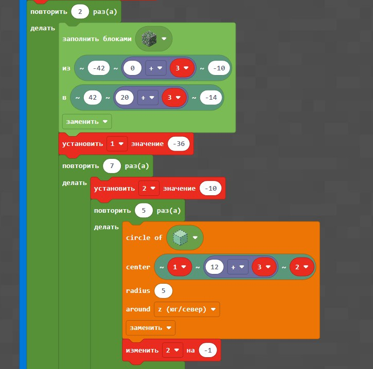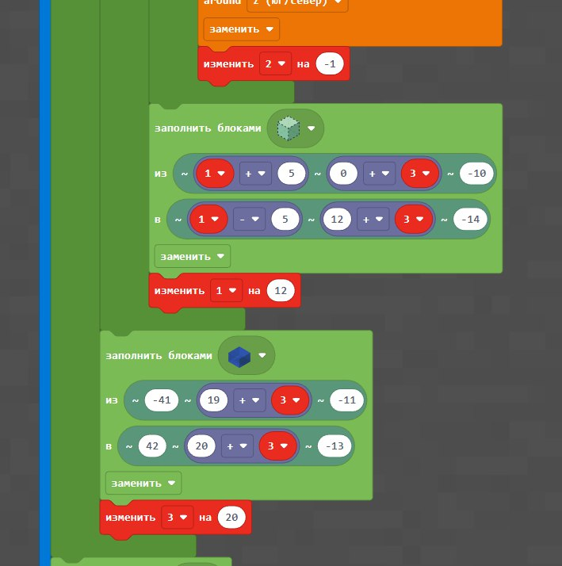

Після цього добудовуємо вже **знайомий нам басейн.**

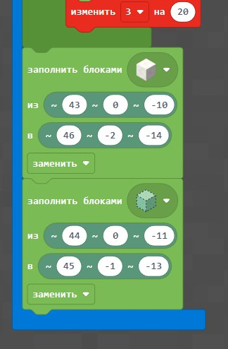

## Додаткові завдання

### 1. Побудова трьох акведуків

Побудову трьох акведуків (двох з попереднього коду та меншого над ними) починаємо навпаки з побудови **басейну для води.**

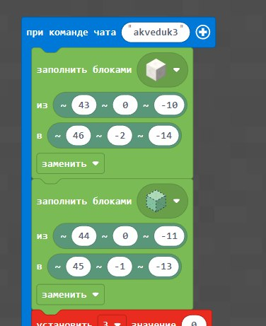

Далі повністю повторюємо кодування **другого акведуку.**

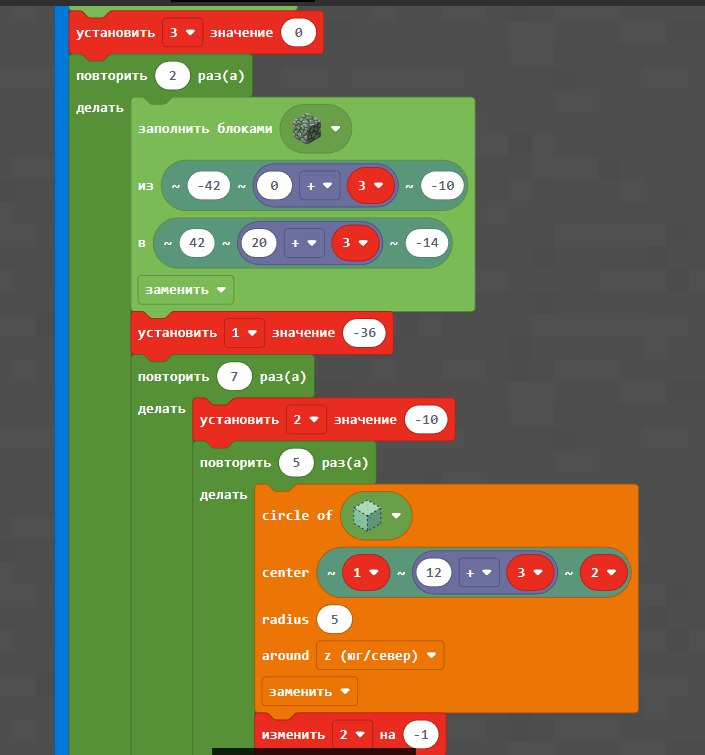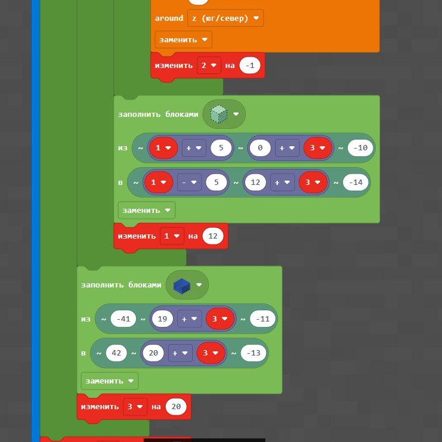

Після цього змінюємо **змінну «3» на 40** (_бо попередні два акведуки вже вгору до 40го блоку_).&#x20;

**Робимо копію першої частини коду** (цикл в 2 рази верхній копіюємо і прибираємо цикл — залишаємо тільки один прогін).&#x20;

Вдповідно зменшуємо радіус кола, що буде вирізатися до 2х. Через це блоки стіни заповнюємо в **ширину від -40 до 40** (в крайніх перегородках буде по 2 блоки, а в інших по одному).&#x20;

Даємо **змінній «1» значення -36**, чого якраз вистачить, щоб **зробити 13 повторів**.&#x20;

**Змінна «2» залишається без змін** (починається **з -10**).&#x20;


Відповідно не забувамо змінювати **висоту наших елементів** (зменшуємо), не забуваємо у блоку вирізання **повітрям після кола** зробити заміну в координатах захід/схід відповідно до радіусу поточного кола в **2 блоки**. Також не забуваємо змінити висоту та довжину **(від -39 до 40)** блоків з водою


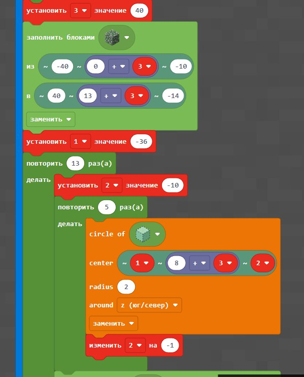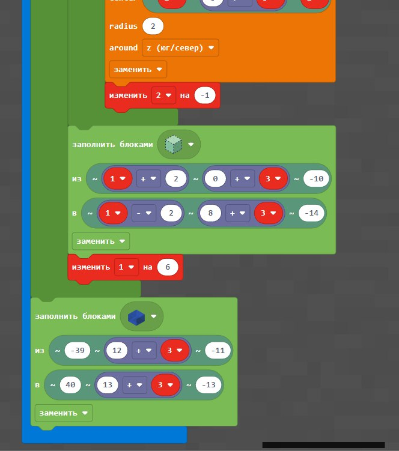

### 2. Побудови **водної дороги**

Для побудови **водної дороги** ми робимо спочатку водоймище, над яким повинна проходити дорога. Знову даємо нашій змінній «1» **значення -36**. АЛЕ для водної дороги ми розширили наш акведук, тому значення північ/південь трохи зміняться

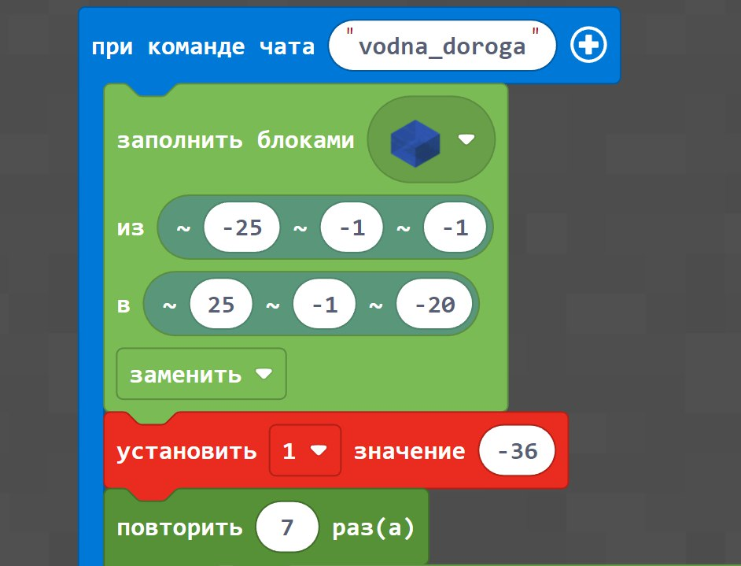

Далі починаємо побудову акведуку, але в цьому випадку ми **не робимо** одну товсту стіну, щоб потім вирізати з неї шматки.&#x20;

Ми розбиваємо (умовно) наше кодування подумки на **дві частини**: **прямокутний виріз зі стіни та арку з круглим вирізом.**&#x20;

Прямокутний виріз зі стіни ми робимо наступним чином: від нашого центру майбутнього вирізаного кола будуємо дві пласкі стіни (**змінна «1»** **- 6** в «з» та «до» та змінна «1» **+ 6** в «з» та «до»).&#x20;

Хоч вони і будуть заміняти одне одне, але помилку видавати не буде. Після цього для другої уявної частини з колами будуємо вже нашу стіну, але **не з 0 по 20 блок** в у висоту, а з **13 по 20,** бо якраз на **12 блоці** закінчується побудова стін, а на 13 знаходиться центр кола. Для кола кодування співпадає з попереднім.

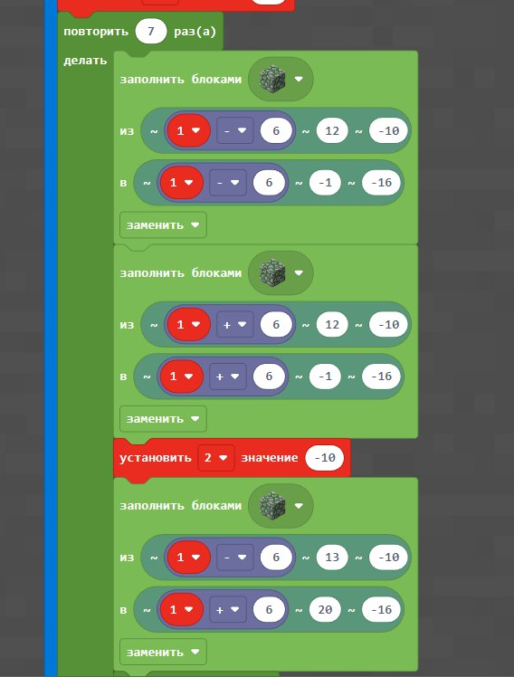

Але не забуваємо, що ми розширювали наш акведук, тому кількість повторів для прорізання отворів також зміняться **з 5-ти до 7-и.**

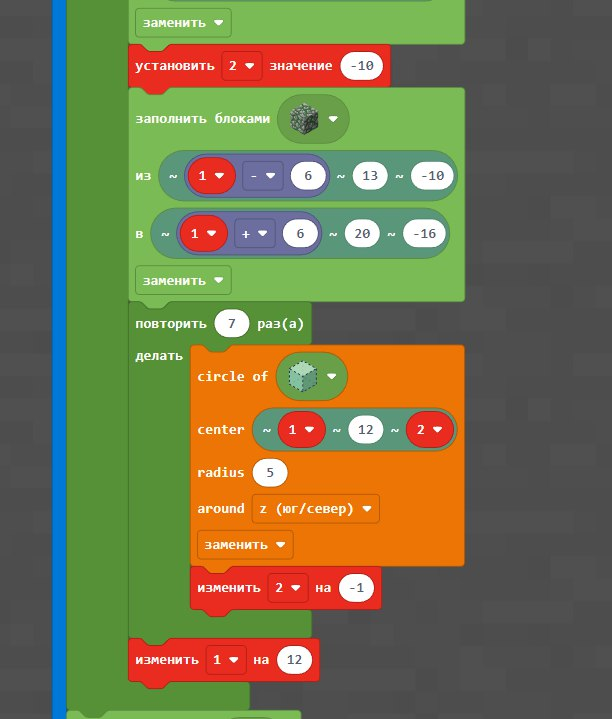

Додаємо **воду і басейн.**

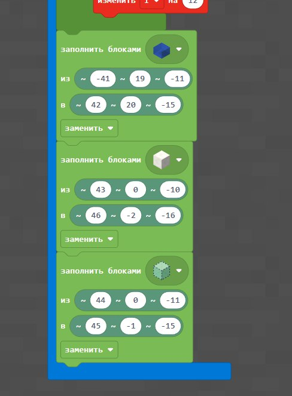

### 3. Побудова пішохідного моста

Для побудови пішохідного моста над водою починаємо побудову з води, потім встановлюємо одразу **2 змінні «1» та «2»**. Після цього користуємося можливістю зробити лінію з нахилом і побудувати за допомогою неї двоє сходів по обох боках моста.&#x20;


**УВАГА!** Координати ліній, особливо захід/схід, повинні бути саме в такому вигляді, бо так сходи «дивляться» у правильному напрямку.


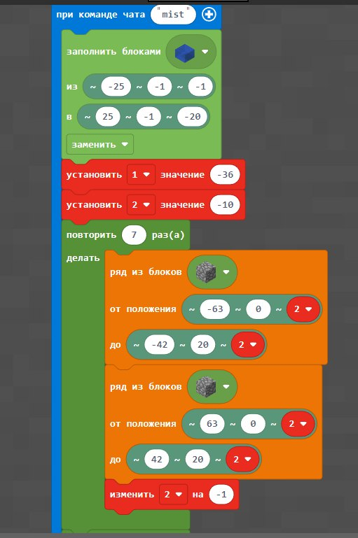

Після цього ми копіюємо **повтор в 7 разів** з попереднього кодування з побудовою стін та прорізанням кіл.

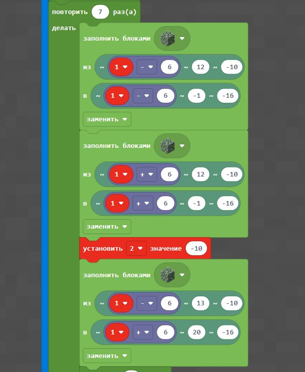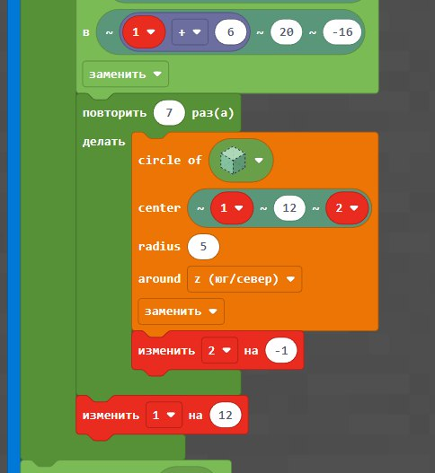

Після цього можна зверху моста заповнити **пішохідну ділянку** іншим видом блоків, додати перила і т.д.

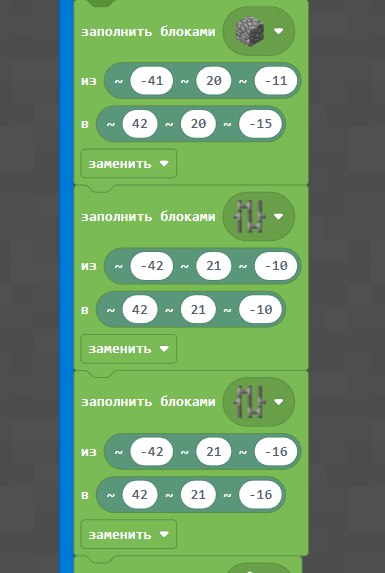

